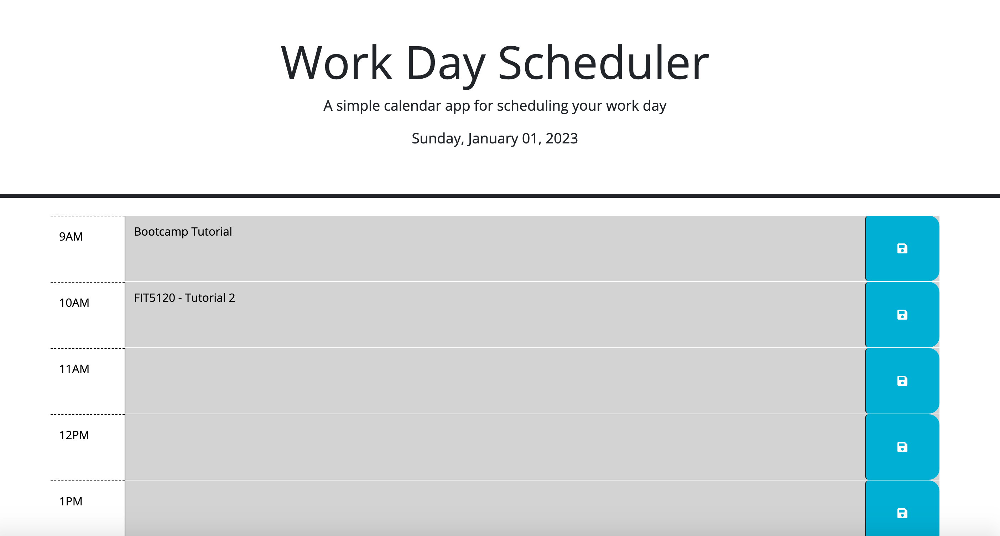

# Work-Day-Scheduler

## Description

The following project generates a color coded time scheduler which allows user to create and save events for working hours during a day. The user is presented timeblocks for standard business hours. The current hour timeblock is coded red while the time in the past is coded grey and the future timeblocks are coded green. The user can write an event in any of the timwblocks and clicking the save button for the corresponding timeblock saves the event to local storage. Thus, the events entered by the user persist across page refreshes. 

## Installation

Clone the Work-Day-Scheduler repository to your local machine. The Work-Day-Scheduler folder contains an index.html file, a style.css file and a script.js file. 

## Usage

Open the index.html file in VS Code and run the file in the browser to view the webpage. 

## License

Please refer to the license in the repository

## Deployed Application link
